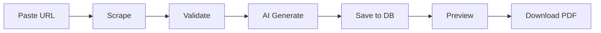

# AI Context

Single source of truth for AI coding assistants.

## Before You Start

**Read all files in `docs/` before creating or modifying anything.**

## What This Is

Web app that converts any URL into a LinkedIn carousel PDF with AI-generated captions.

## Flow



## Stack

| What       | Tech                                        |
| ---------- | ------------------------------------------- |
| Framework  | Next.js (App Router)                        |
| Styling    | Tailwind CSS + shadcn/ui                    |
| Language   | TypeScript strict                           |
| Database   | Supabase                                    |
| AI         | OpenRouter (`google/gemini-2.5-flash-lite`) |
| PDF        | jsPDF                                       |
| Scraping   | Cheerio, Playwright fallback                |
| Rate limit | Upstash Redis                               |

## Project Structure

```
src/
├── app/
│   ├── page.tsx              # Homepage with URL input
│   ├── result/[id]/page.tsx  # Result display + PDF download
│   └── api/
│       ├── scrape/route.ts   # Extract content from URL
│       ├── generate/route.ts # AI generation + save to DB
│       └── result/[id]/route.ts # Fetch saved result
├── components/ui/            # shadcn components
├── lib/
│   ├── scraper/              # Cheerio + Playwright + Reddit
│   ├── ai/                   # OpenRouter client + prompts + schema
│   ├── pdf/                  # jsPDF generator
│   ├── db/                   # Supabase client + queries
│   ├── rate-limit/           # Upstash Redis
│   ├── validation/           # Pre-AI content filter
│   └── errors.ts             # Custom error classes
├── types/                    # Shared types
└── constants/                # App config
```

## AI Output Schema

```typescript
// Success
{
  status: 'success',
  slides: [{ type: 'hook'|'content'|'cta', headline, body?, emoji? }], // 5-8
  captions: [{ text, style: 'professional'|'casual'|'provocative' }], // 3
  hashtags: string[] // max 5
}

// Rejection
{
  status: 'rejected',
  reason: 'content_too_shallow'|'no_actionable_insight'|'spam_or_gibberish'|'inappropriate_content',
  message: string
}
```

## Code Conventions

- Absolute imports: `@/lib/...`, `@/components/...`
- Components: PascalCase, Utilities: camelCase
- No `any` - use `unknown` if needed
- Zod for runtime validation
- Custom errors in `lib/errors.ts`

## Commands

```bash
pnpm dev          # dev server
pnpm build        # production build
pnpm lint         # eslint
pnpm type-check   # tsc --noEmit
```

## Key Files

| File                   | Purpose               |
| ---------------------- | --------------------- |
| `lib/ai/prompts.ts`    | AI system prompt      |
| `lib/scraper/index.ts` | Scraping orchestrator |
| `lib/pdf/generator.ts` | PDF generation        |

## Gotchas

- Reddit: append `.json` to URL, no scraping needed
- Playwright only as fallback, not primary
- PDF generated client-side, not stored
- Rate limit: 5/IP/day via Upstash
