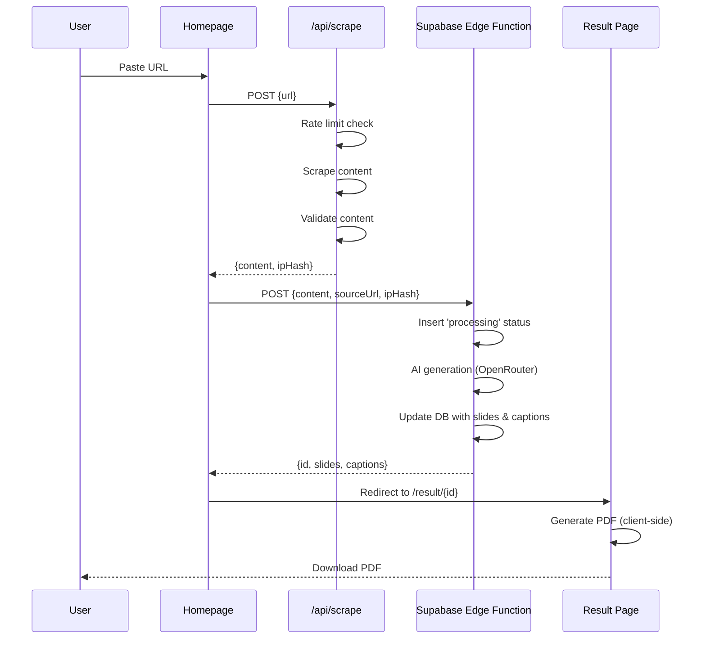
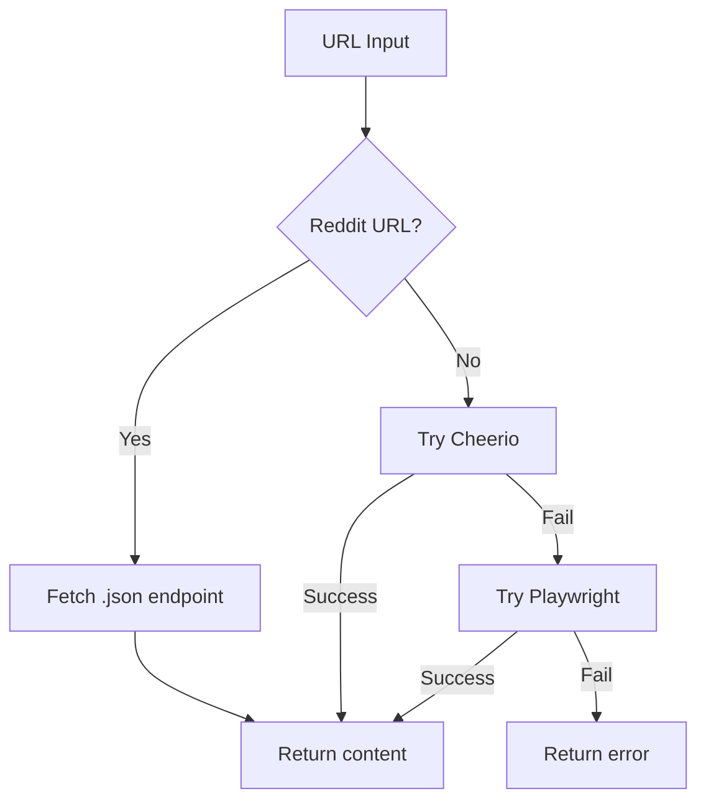

# Architecture

Technical reference. For quick overview, read `AI_CONTEXT.md`.

## System Flow

```mermaid
flowchart LR
    A[Homepage] --> B[/api/scrape]
    B --> C[Supabase Edge Function: generate-post]
    C --> D[Result Page]
    D --> E[PDF Download]

    B -.-> F[(Upstash Redis)]
    C -.-> G[(Supabase DB)]
    C -.-> H[OpenRouter AI]
    D -.-> G
```

## Request Flow



## Scraping Strategy



## Data Schema

### Table: generations

Stores extracted content and generated slides/captions.

| Column            | Type  | Description                         |
| ----------------- | ----- | ----------------------------------- |
| id                | UUID  | Primary Key                         |
| source_url        | TEXT  | Origin URL                          |
| extracted_content | TEXT  | Raw text from scraper               |
| slides_json       | JSONB | Array of slide content              |
| captions          | JSONB | Array of captions                   |
| status            | TEXT  | pending/processing/completed/failed |
| user_profile_id   | UUID  | Reference to user_profiles          |

### Table: user_profiles

Persists branding settings (handle, profile pic) for users.

| Column          | Type | Description                 |
| --------------- | ---- | --------------------------- |
| id              | UUID | Primary Key                 |
| handle          | TEXT | LinkedIn handle (@username) |
| profile_pic_url | TEXT | URL to Supabase Storage     |

## API Routes

### POST /api/scrape

Extracts content from URL.

```typescript
// Request
{ url: string }

// Response (success)
{
  success: true,
  data: {
    title: string,
    content: string,
    wordCount: number,
    charCount: number,
    source: 'cheerio' | 'playwright' | 'reddit-json',
    ipHash: string
  }
}
```

### Supabase Edge Function: generate-post

Generates LinkedIn post via AI and saves to DB.

```typescript
// Request
{
  content: string,
  sourceUrl: string,
  ipHash: string,
  userProfileId?: string,
  personalization?: { handle, style, profilePic, showSource }
}

// Response (success)
{
  success: true,
  data: {
    id: string,
    slides: Slide[],
    captions: Caption[],
    hashtags: string[]
  }
}
```

## Content Validation (Pre-AI)

```typescript
MIN_CHARS = 200;
MIN_WORDS = 50;
MIN_ALPHA_RATIO = 0.5; // Must be mostly text, not code
```

## AI Prompt Strategy

Single call with rejection capability:

- Generates 5-8 slides
- Returns rejection JSON if content lacks value
- Strict JSON output format

## PDF Generation

Client-side with jsPDF:

- Gradient backgrounds (5 color themes)
- Adaptive font sizes based on headline length
- Slide type indicators (SWIPE →, FOLLOW FOR MORE)
- Page numbers

No server storage - PDF regenerated on demand.

## Rate Limiting

- Configurable daily limit per IP via Upstash Redis
- IP hashed before storage for privacy
- Fallback mechanism to allow-all in development if Upstash is not configured

## Error Handling

All errors extend `AppError`:

- `ScrapingError` - fetch/parse failures
- `ValidationError` - content too short, etc.
- `AIError` - OpenRouter failures
- `RateLimitError` - exceeded daily limit

API response format:

```typescript
{ success: false, error: { code: string, message: string } }
```
